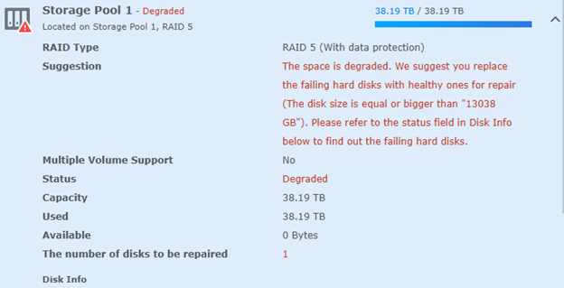
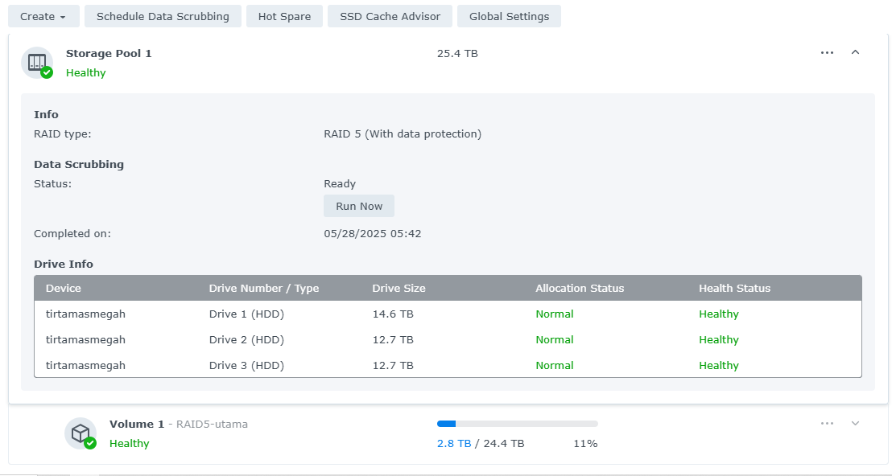

# NAS RAID 5 Recovery – Synology (Mei 2025)

Dokumentasi proses recovery RAID 5 pada NAS Synology milik kantor, dilakukan secara manual setelah disk mengalami kegagalan (bad sector) dan proses rebuild gagal.

---

## 🧾 Ringkasan Kasus

- **NAS Model**: Synology
- **RAID Type**: RAID 5
- **Jumlah Disk**: 4 HDD
- **Total Data**: ±4 TB
- **Masalah Utama**: Disk 3 mengalami *degraded* dan *bad sector* berat

---

## ⚠️ Gejala

- Volume masih dapat diakses tapi muncul warning: `Storage Pool 1 - Degraded`
- Backup segera dilakukan ke storage eksternal
- Proses rebuild RAID gagal meskipun sudah ganti HDD

---

## 🔍 Diagnosis

- HDD #3 menunjukkan sektor rusak parah (SMART di bawah ambang)
- HDD #1 juga terdeteksi mulai menurun (SMART Health: 87%)
- Proses `repair` via antarmuka Synology dan `putty` gagal
- Kemungkinan: RAID tidak bisa rebuild karena dua disk dalam kondisi meragukan

---

## 🔄 Solusi yang Diterapkan

1. Backup seluruh folder dan file `.dss` (security folder metadata) dan `permissions_backup.txt`
2. Lepaskan disk #3, pasang HDD baru dengan ukuran ≥ disk sebelumnya
3. Mencoba rebuild → gagal
4. Membuat ulang RAID 5 dari awal menggunakan:
   - 2 HDD lama (SMART 100%)
   - 1 HDD baru
5. Restore semua data dan user permission secara manual

---

## ✅ Hasil Akhir

- RAID 5 berhasil dibuat ulang dengan 3 disk sehat
- Data ±4TB berhasil dikembalikan dari backup
- Permission user dan struktur folder direstore
- Volume dan storage pool kembali `Healthy`

---

## 📁 Tips Dokumentasi

- Simpan hasil backup permission dan struktur folder di tempat terpisah
- Lakukan `Data Scrubbing` secara berkala di Synology (lihat tab)
- Pantau SMART status HDD secara rutin (gunakan email notifikasi jika tersedia)

---

## 🧠 Pembelajaran

- **RAID 5 bukan backup** — tetap butuh backup harian/mingguan ke device eksternal
- Disk yang "masih bisa diakses" belum tentu aman untuk rebuild
- Proses manual bisa jadi lebih aman daripada memaksa sistem melakukan restore otomatis
